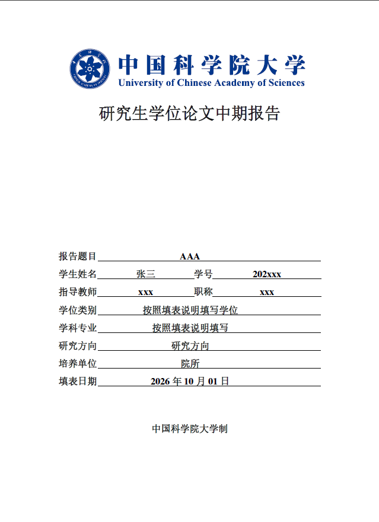
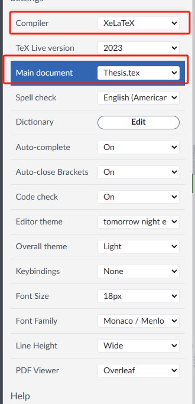

<!--
 * @Author: likecanyon 1174578375@qq.com
 * @Date: 2026-09-30 20:34:17
 * @LastEditors: likecanyon 1174578375@qq.com
 * @LastEditTime: 2026-10-01 09:40:28
 * @FilePath: \MidTermReport\README.md
 * @Description: 这是默认设置,请设置`customMade`, 打开koroFileHeader查看配置 进行设置: https://github.com/OBKoro1/koro1FileHeader/wiki/%E9%85%8D%E7%BD%AE
-->


# 中国科学院大学研究生学位论文中期报告LaTex模板

- 基于https://github.com/myzhibei/UCAS_Interim_Report
和
https://github.com/mohuangrui/ucasthesis
,完善了封面字体和下划线位置。
- 完善了README.md。



## 填表说明和报告提纲如何修改
「报告提纲」这一页**不是 LaTeX 生成的**，它来自官方表格 PDF `Tex\Interim.pdf` 的第 2 页。

**插入位置**：`Tex\Frontmatter.tex:9`
```latex
\includepdf[pages=1-2]{Tex/Interim.pdf}
```
- `pages=1-2`：第 1 页是"填表说明"，第 2 页就是"报告提纲"（含 一/二/三 三条提纲和"注意"）

**如何修改**：内容在 `Tex\Interim.pdf` 文件里，LaTeX 无法改其内部文字，需用 PDF 编辑器（如 Adobe Acrobat、Foxit）直接改这个 PDF，或从官方 Word 模板重新生成后替换该文件。

**如何删去这一页**：改 `Frontmatter.tex:9` 的 `pages`：
- 只删"报告提纲"页（保留填表说明）：`\includepdf[pages=1]{Tex/Interim.pdf}`
- 两页都不要：注释/删除整行 `\includepdf[...]` 语句

改完保存后重新编译即可。

## 如何编译

### 1. 环境要求

- **LaTeX 发行版**：TeX Live 2024 或 MiKTeX（本项目在 Windows 上使用 MiKTeX 25.4 验证通过）
- 中文论文务必使用 **XeLaTeX**，参考文献用 **BibTeX**

### 2. 在哪里写内容

| 内容 | 文件 |
| --- | --- |
| 封面信息（题目、姓名、学号、导师、学位、专业、院所） | `Tex\Frontinfo.tex` |
| 各章正文 | `Tex\Chap_*.tex`，新章节在 `Tex\Mainmatter.tex` 中 `\input` |
| 参考文献条目 | `Biblio\ref.bib` |
| 图片 | 放入 `Img\`，正文用 `\includegraphics{文件名}` 引用 |

### 3. 编译方法

**方法一：脚本一键编译（推荐）**

在模板根目录下双击 `artratex.bat`，脚本自动执行：

```
xelatex → bibtex → xelatex → xelatex
```

编译结果在 `Tmp\Thesis.pdf`。每次改完保存后重新双击即可。

**方法二：手动命令**

在模板根目录依次执行：

```bash
xelatex -output-directory=Tmp Thesis
bibtex Tmp/Thesis
xelatex -output-directory=Tmp Thesis
xelatex -output-directory=Tmp Thesis
```

**方法三：VS Code + LaTeX Workshop**

1. 安装插件 LaTeX Workshop
2. 用 VS Code 打开本仓库文件夹（已内置 `.vscode/settings.json` 配置）
3. 左侧 TeX 面板点 `Build LaTeX project`（或 `Ctrl+Alt+B`），选择 `xelatex + bibtex + xelatex + xelatex` 配方
4. `Ctrl+Alt+V` 侧边预览，默认保存后自动编译

### 4. 注意事项

- 编译命令必须在模板根目录（含 `Style/`、`Tex/`、`Biblio/`）下执行
- 首次编译较慢：MiKTeX 会自动联网下载缺失宏包，之后缓存就不再下载
- 若 MiKTeX 报 `l3-too-old` 等 xeCJK 加载失败错误，先执行 `mpm --update` 更新全部宏包
- Windows 下中文自动使用系统字体（宋体/黑体），无需额外安装；封面字号字体等修改见 `Style/ucasthesis.cls` 的 `\maketitle`


## 中国科学院大学学位论文LaTex模板 2023 版本

## 使用说明

2022年修订的《中国科学院大学研究生学位论文撰写规范和指导意见》（以下简称《指导意见》）从2023年冬季批次开始实施。为方便各位同学使用，特提供此模板。

您在使用此模板进行学位论文撰写时，只需根据《指导意见》在相应章节填写具体内容即可。


### 1. 下载模板

- 每个学院都提供了下载链接，以各个学院的要求为准
- 这个repo会根据反馈实时更新修正问题，可能与学院提供的模板有所不同
- 如遇到问题，请在issue中提出，我们会尽快解决并更新在这个repo中
- ！当前这个repo的模板与word版本的行距是对齐的。如果论文里的边距看起来过窄，请替换artratex.sty为当前repo里的版本。

### 2. 使用模板
支持的系统：Windows, Linux, MacOS，同时支持Overleaf, OnlineLaTex(推荐，Overleaf限制了普通用户的编译时长，大概率无法完全编译成功，切换为OnlineLaTex可以）等在线LaTeX软件

中文论文务必使用 XeLaTeX 

Overleaf/OnlineLaTex 的配置参考下图，选择 XeLaTeX 编译器，编译器版本选择 TeX Live 2023。




## 参考

- https://github.com/MingfuYAN/UCAS-Interim

- https://github.com/myzhibei/UCAS_Interim_Report

- https://github.com/mohuangrui/ucasproposal

- https://github.com/streamer-AP/UCAS_Paper_2023

- https://github.com/mohuangrui/ucasthesis

